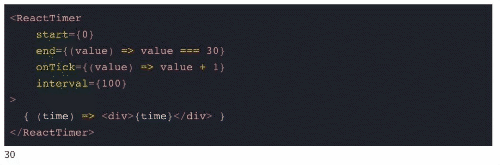

# react-timer
> A minimalistic yet customizable timer component!


[Live demo](https://xendora.github.io/react-timer/examples)

   
 



## Installation
### For NPM

```
npm install @xendora/react-timer
```

### For Yarn

```
yarn add @xendora/react-timer
```

### Usage
```js
import ReactTimer from "@xendora/react-timer";

// Incremental counter
<ReactTimer
    interval={100}
    start={0}
    end={t => t === 100}
    onTick={t => t + 1}
>
    {time => <span>{time}</span>}
</ReactTimer>

// Decremetal counter
<ReactTimer
    interval={100}
    start={100}
    end={t => t === 0}
    onTick={t => t - 1}
>
    {time => <span>{time}</span>}
</ReactTimer>

// Infinite counter
<ReactTimer
    interval={100}
    start={0}
    end={t => false}
    onTick={t => t + 1}
>
    {time => <span>{time}</span>}
</ReactTimer>
```

## Props
| Name  | Type |  Description |
| ------------- | ------------- | ------------- |
| children  | object (required)  |    Define your react component here           |
| start | number (required)  | A start value for the timer               |
| end | function (required)  | A function which determines the end for the timer              |
| interval | number | An interval value for the timer. Default is 1 second               |
| onTick | function (required)  | A callback function where the next computed value is determined               |
| onEnd | function   | A callback function which executes when the timer stops executing               |
---

## License

MIT © [xendora](https://github.com/xendora)